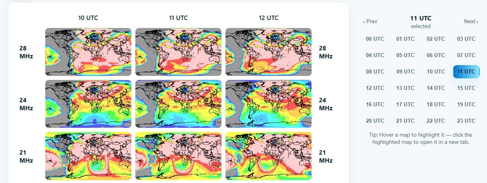

# HamCAP-Maps
Generate a table of VOACAP area coverage maps, created by HamCAP

This index.html contains the required CSS, JavaScript and HTML code to produce a table of VOACAP area coverage maps, generated by HamCAP. All contest bands (3.5 to 28 MHz) are visible at once, and you can click the hours or arrows to scroll the hours back and forth.

The use of VOACAP hours is enforced; in other words, an hour spans from xx:30 to yy:30. For example, 07 UTC spans from 06:30 UTC to 07:30 UTC.

